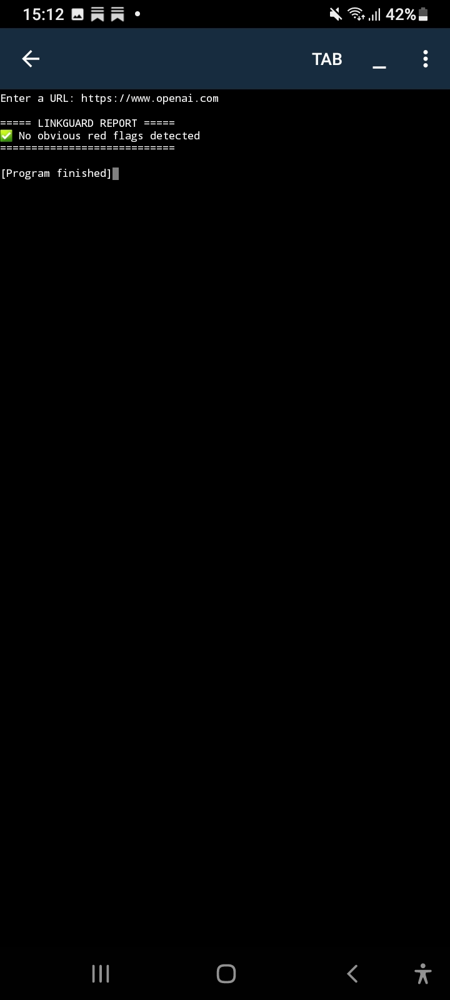

<h1 align="center">🔒 LinkGuard</h1>

<p align="center">
  
  
  
</p>

<p align="center">
A cybersecurity-oriented URL inspection tool that performs heuristic analysis to identify common phishing indicators and assess potential security risks associated with web links.
</p>

# LinkGuard 🔒

A cybersecurity-oriented URL inspection tool that performs heuristic analysis to identify common phishing indicators and assess potential security risks associated with web links.

## Overview

LinkGuard is a Python-based security tool that analyzes URLs using rule-based detection techniques. It evaluates several characteristics commonly associated with phishing attempts and suspicious websites, helping users identify potential risks before visiting a link.

This project was developed to explore foundational cybersecurity concepts, URL analysis techniques, and secure software development practices.

## Features

- HTTPS validation
- Suspicious keyword detection
- IP address URL detection
- Long URL identification
- Clear security assessment reporting
- Lightweight and easy to use

## Technologies Used

- Python 3
- urllib.parse
- Regular Expressions (re)

## How It Works

LinkGuard analyzes a URL and performs a series of security checks, including:

1. Verifying whether the URL uses HTTPS.
2. Detecting keywords commonly found in phishing campaigns.
3. Identifying URLs that use IP addresses instead of domain names.
4. Flagging unusually long URLs that may be attempting to obscure malicious intent.

The results are displayed in a concise security report.

## Installation

Clone the repository:

```bash
git clone https://github.com/byboledi/linkguard.git
```

Navigate to the project directory:

```bash
cd linkguard
```

Run the application:

```bash
python linkguard.py
```

## Example Usage

Input:

```text
https://www.openai.com
```

Output:

```text
===== LINKGUARD REPORT =====

✅ No obvious red flags detected

============================
```

## Demonstration

The screenshot below shows LinkGuard successfully analyzing a URL and generating a security assessment report.



## Future Enhancements

- Risk scoring system
- URL shortening detection
- Domain reputation analysis
- Security API integration
- Graphical user interface (GUI)
- Exportable scan reports

## Disclaimer

LinkGuard is an educational cybersecurity project intended for learning and demonstration purposes. It should not be considered a replacement for professional threat intelligence platforms or enterprise security solutions.

## Author

**Boledi**

Aspiring software developer with an interest in cybersecurity, Python development, and security-focused applications.

---

⭐ If you found this project interesting, consider starring the repository.
